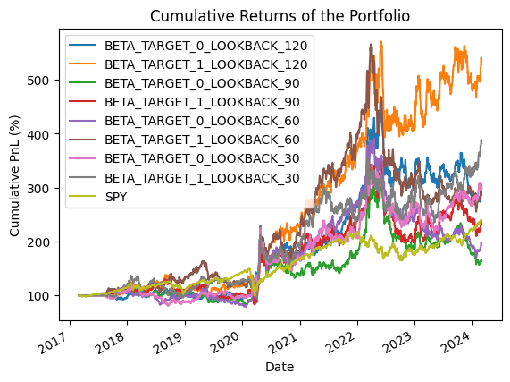
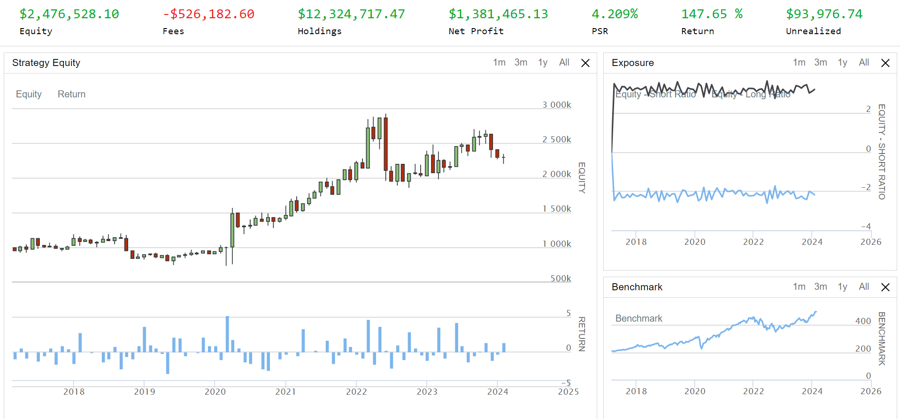

# Global Macro Long/Short Strategy with Target Beta
This project implements and analyzes a Global Macro Long/Short strategy based on portfolio optimization with a target beta. The strategy aims to understand the impact of different target betas and the length of the look-back period used for estimating the covariance matrix and expected returns on the portfolio's performance and risk characteristics.

*Image source: [https://www.fitchsolutions.com/bmi/long-reads/macroeconomic-insight/global-macro-outlook-global-growth-slowing-faster-we-expected]*

## Investment Strategy

The strategy optimizes a portfolio of 12 ETFs, representing various asset classes and geographies, which are:

1. CurrencyShares Euro Trust (FXE)
2. iShares MSCI Japan Index (EWJ)
3. SPDR GOLD Trust (GLD)
4. Powershares NASDAQ-100 Trust (QQQ)
5. SPDR S&P 500 (SPY)
6. iShares Lehman Short Treasury Bond (SHV)
7. PowerShares DB Agriculture Fund (DBA)
8. United States Oil Fund LP (USO)
9. SPDR S&P Biotech (XBI)
10. iShares S&P Latin America 40 Index (ILF)
11. iShares MSCI Pacific ex-Japan Index Fund (EPP)
12. SPDR DJ Euro Stoxx 50 (FEZ)

The optimization problem is set up with an objective function that minimizes risk while targeting a specific portfolio beta. The portfolio is subject to holding constraints, limiting the weight of each asset between -0.5 and 0.5.

The strategy is backtested over the period from March 2017 to February 2024, with weekly rebalancing. Four different look-back periods (30, 60, 90 and 120 data points) are used to estimate the covariance matrix and expected returns, and two target beta values (0 and 1) are considered. 

## Optimization Settings
Optimize a portfolio using the following structure:\
Objective: Minimize quadratic function $\frac{1}{2} \omega^T \Sigma \omega - \rho^T \omega$\
Constraints: $\beta_p^T \omega = \beta_T$ and $\sum_{i=1}^{n} \omega_i = 1$, with $-0.5 \leq \omega_i \leq 0.5$\
Inputs:

$\Sigma$: Sample covariance matrix of returns\
$\rho$: Vector of expected returns\
$\beta_p$: Portfolio beta relative to S&P 500 (SPY ETF)\
$\beta_T$: Target beta (e.g., 0 or 1)

## Strategy Settings

1. **Weekly Rebalancing**: Portfolio is re-optimized every week from March 2017 to February 2024.
2. **Look-back Periods**:
   - Long-Term: 120 data points
   - Medium-Term: 90 data points
   - Medium-Short Term: 60 data points
   - Short-Term: 30 data points
3. **Target Beta Values**: 0 and 1

## Backtesting Results

| Metric                 | BETA_0_120 | BETA_1_120 | BETA_0_90 | BETA_1_90 | BETA_0_60 | BETA_1_60 | BETA_0_30 | BETA_1_30 | SPY      |
|------------------------|------------|------------|-----------|-----------|-----------|-----------|-----------|-----------|----------|
| Annual Return          | 0.1626     | 0.2689     | 0.0728    | 0.1284    | 0.0999    | 0.1703    | 0.1676    | 0.2114    | 0.1326   |
| Max Drawdown (%)       | -38.1904   | -31.7365   | -50.0608  | -44.2020  | -56.8051  | -54.9864  | -37.4917  | -33.6536  | -33.7173 |
| Sharpe Ratio           | 0.6544     | 0.8809     | 0.3845    | 0.5262    | 0.4682    | 0.6357    | 0.6735    | 0.7569    | 0.7484   |
| Volatility             | 0.0188     | 0.0210     | 0.0188    | 0.0213    | 0.0188    | 0.0212    | 0.0185    | 0.0202    | 0.0120   |
| VaR (%)                | -2.5694    | -2.9809    | -2.7116   | -3.1159   | -2.7488   | -3.0313   | -2.6481   | -2.9218   | -1.7744  |
| CVaR (%)               | -4.1454    | -4.5749    | -4.1913   | -4.6950   | -4.1394   | -4.7209   | -3.9159   | -4.2759   | -2.9504  |

The raw backtesting performance results indicates that

- The highest annual return (26.89%) is achieved with a beta target of 1 and a lookback period of 120 days, followed by a beta target of 1 and a lookback period of 30 days (21.14%).
- The lowest max drawdown (-31.74%) is observed for a beta target of 1 and a lookback period of 120 days, while the highest max drawdown (-56.81%) is seen for a beta target of 0 and a lookback period of 60 days.
- The highest Sharpe Ratio (0.8809) is achieved with a beta target of 1 and a lookback period of 120 days, indicating the best risk-adjusted performance among the tested combinations.

Overall, the combination of a **beta target of 1 and a lookback period of 120 days** appears to provide the best performance in terms of annual return, max drawdown, and risk-adjusted return (Sharpe Ratio).

## QuantConnect Results
To obtain more accurate and robust results, the strategy was implemented and backtested using QuantConnect, a platform that incorporates realistic trading conditions such as trading fees and liquidity constraints. By leveraging QuantConnect's capabilities, the backtesting results provide a more reliable measure of the strategy's performance in a real-world trading environment. The inclusion of trading fees and liquidity considerations ensures that the reported performance metrics are more representative of the strategy's potential outcomes when deployed in live trading.

QuantConnect Results Summary
- Total Equity: $2,476,528.10
- Net Profit: $1,381,465.13 (147.653%)
- Compounding Annual Return: 13.814%
- Sharpe Ratio: 0.411
- Probabilistic Sharpe Ratio (PSR): 4.209%
- Sortino Ratio: 0.495
- Drawdown: 39.100%
- Profit-Loss Ratio: 1.08
- Alpha: 0.04
- Beta: 0.914
- Annual Standard Deviation: 0.28
- Information Ratio: 0.136
- Tracking Error: 0.24
- Treynor Ratio: 0.126
- Total Fees: $526,182.60
- Portfolio Turnover: 136.82%

Please refer to the backtesting report for a detailed summary of the strategy's performance and risk metrics from QuantConnect.

## Performance and Risk Analysis

The Global Macro Long/Short strategy, particularly with a beta target of 1 and a lookback period of 120 days, demonstrates strong performance potential, with a high annual return and a favorable risk-adjusted return (Sharpe Ratio). When implemented on QuantConnect, the strategy generates a substantial net profit and maintains a good risk-reward profile, as evidenced by the Sharpe Ratio.

However, the strategy is not without risks. The high maximum drawdown highlights the potential for significant losses during adverse market conditions. Additionally, the strategy's high portfolio turnover suggests active trading, which may lead to increased transaction costs and potential market impact.

The strategy's performance is sensitive to the choice of lookback period and beta target, underlining the importance of carefully selecting and monitoring these parameters to ensure the strategy remains effective under changing market conditions.

In summary, while the Global Macro Long/Short strategy shows promise in terms of performance, investors should be aware of the associated risks, such as high drawdowns and turnover. It is crucial to align the strategy with individual risk tolerance and investment objectives and to continuously monitor its performance and risk characteristics. As with any investment strategy, diversification and proper risk management techniques should be employed to mitigate potential losses.